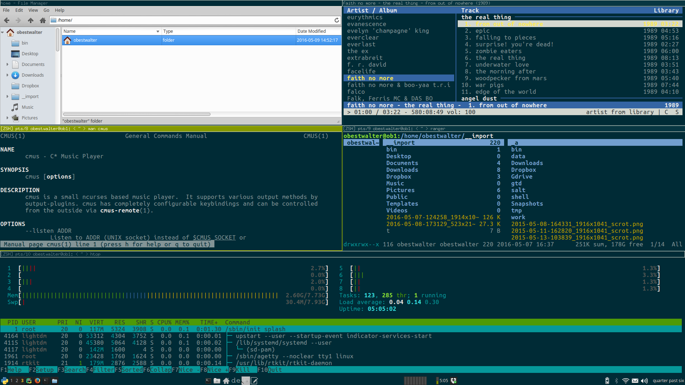

# My [i3wm](https://i3wm.org/) environment

## What?

My computer is my virtual workplace and living room. It needs to be functional and cozy. The big desktop environments are too opinionated and restricting in the way how I am supposed to use my computer. i3 helps me to [take the power back](https://www.tape.tv/rage-against-the-machine/videos/take-the-power-back-live).

I want to control this ... 

Mainly with this ...

and i3 is really great for that.

## Why?

I have been pushing around windows on a screen for literally decades now and it got a little bit tiring at some point. A tiling window manager takes away a lot of that window pushing by always opening applications maximized and giving the user complete control over layout and navigation with the keyboard. After a week of complete agony with that new way of doing stuff on a computer I started to enjoy it and now there is no way back. I like the way I can manipulate windows and navigate between them with the keyboard. The absolute killer feature of i3 is how graceful it lets you handle [multi monitor setups](http://i3wm.org/docs/userguide.html#multi_monitor). 

As i3 is "only" a window manager, there is a lot of stuff that needs to be taken care of that is usually part of a fully fledged desktop environment. All of a sudden things you took for granted are gone. But I want auto mounting, power management, network management, program launchers and a nice panel with lots of little icons and stuff. There are two approaches to deal with that: either add everything yourself by mixing and matching daemons from DEs and self made scripts or use a desktop environment that can use i3 as a window manager. In my [old setup](https://github.com/obestwalter/i3config/tree/stable-gnome-setup) I used the first approach and ended up with a combination of i3 standalone with the `gnome-settings-daemon` and some self built little scripts. 

That was o.k. but I like to experiment. So at the moment I am playing with [XFCE](http://www.xfce.org) as the host using i3 as the window manager to see how this turns out.

## How?

**TBD** (first stumps in [docs](docs/))
