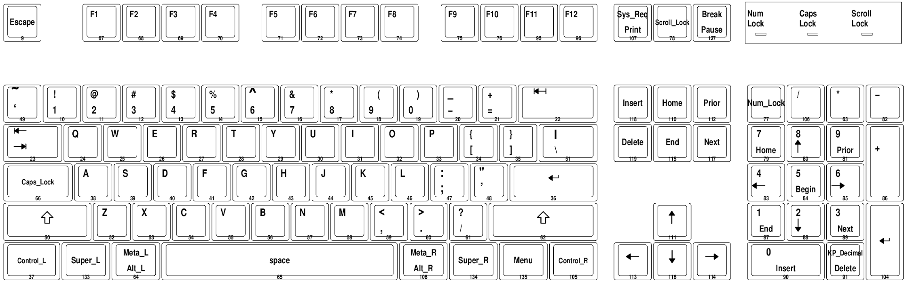

# Keyboard

## Who is grabbing what?

All global keyboard shortcuts should be managed from i3 if possible, so all in `xfce4-keyboard-settings` should be removed.

https://faq.i3wm.org/question/5483/how-can-i-list-all-xorg-and-i3-keybindings-currently-in-effect/

## Layout

### Explore

german layout: `xkeycaps -keyboard PC105DE`

us layout: `xkeycaps -keyboard PC105`

    cat /usr/share/X11/xkb/symbols/de

### Change

http://ubuntuforums.org/showthread.php?t=188761

## Unsorted links to tools and tutorials that might be useful

http://xahlee.info/linux/linux_xmodmap_tutorial.html

http://xahlee.info/linux/linux_keyboard_tools.html

**TODO** checkout xbindkeys (.xbindkeyrc) | show keys -> Control+Shift+q
https://faq.i3wm.org/question/6901/mouse-button-press-hold-release-through-keyboard.1.html

http://xahlee.info/linux/linux_xbindkeys_tutorial.html

# Simulate keystrokes

http://www.semicomplete.com/projects/xdotool/

http://xmodulo.com/simulate-key-press-mouse-movement-linux.html

    xdotool key --window "$(xdotool search --class Chrome | head -n 1)" F5
